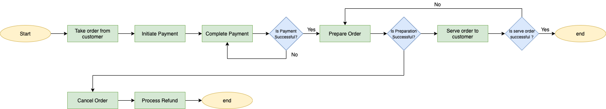
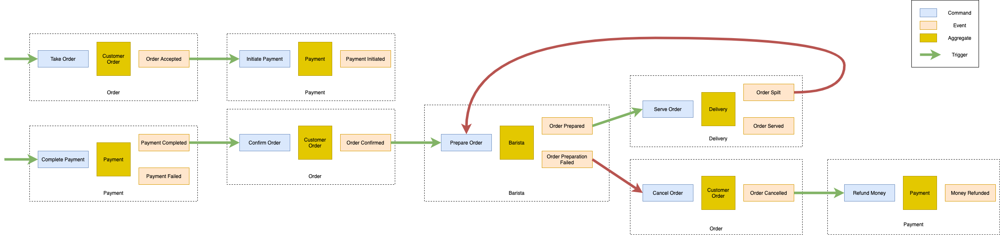
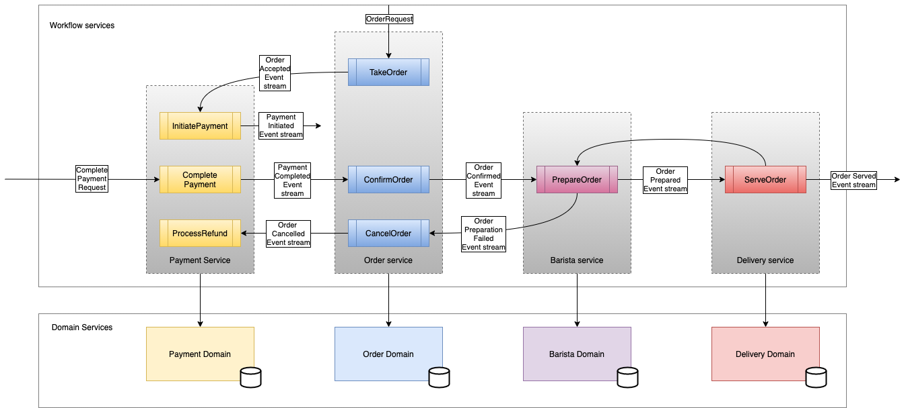

# Serving hot coffees using choreography & saga patterns in microservices

This repository contains a sample implementation of saga pattern in choreographed workflow. It is built
using [Kotlin](https://kotlinlang.org/) and [Spring Boot](https://spring.io/projects/spring-boot). Along with
that [Spring Cloud Stream](https://docs.spring.io/spring-cloud-stream/docs/3.1.3/reference/html/) to implement the
workflow services. Also, in this example we are using [Kafka](https://kafka.apache.org/) as the event bus.

## Background

### The Choreography Pattern

In choreography architecture a workflow is implemented using highly decoupled and reactive microservices. These
microservices with their own bounded context, execute the business functionality by reacting to the input event stream
and emit new events to the downstream consumers. In the choreographed workflow producers of the event stream are
completely unaware of the business functionalities executed by the downstream consumers.

This pattern is similar to a dance performance where each dancer knows her role and can perform it independently. Hence,
there is no need of external control or to tell her what should be done.

### The saga pattern

The saga pattern is used to handle the distributed transactions. A distributed transaction is that spans two or more
microservices. Each participating microservice implements the logic to execute its portion of transaction as well as to
revert it.

The distributed transaction is tracked using a `saga id`. While implementing the saga pattern with choreography, this
identifier should be present in all the events produced as the part of the given distributed transactions. This
identifier is used by participating services to identify the local transactions to be reversed.

## Example: Coffee ordering flow

### Workflow

Here is the flow we will be implementing using choreography.

> We take order from the customer and initiate the payment.
>
>Once the payment in completed, we confirm the order. After the order is confirmed, we prepare the beverage. Upon preparing the order, we serve it to our customer.
>
>If the order preparation fails, we cancel the order. Once the order is cancelled, we process the refund and money is returned to the customer.
>
>Sometimes while serving when we accidentally spill the order, we simply prepare it again and serve it to the customer.

### Analysis

The flowchart below describes the various steps that are taken during the workflow.



The event storming exercise can help us to get the list of the events and aggregates which emit them.



## Implementation

### Architecture

Based on the event storming we have come up with following architecture where services are divided between 2 layers.

- **Domain services:**

  Services which responsible for implementing the business capabilities.

- **Workflow services:**

  Services which are responsible for implementing the actual workflow. They invoke domain services to execute the
  business capabilities as part of the flow. Workflow services coordinate with other workflow services by negotiating
  event contracts. Their responsibility also includes error handling (retries, DLQs etc.), business validation.



Each service described in the diagram above contains one more event processor functions. These command handlers consume
one or more incoming event streams, and they produce one or more event streams.

#### Event processor / Workflow functions / Steps

This example models event processors as functions and binds them to corresponding kafka topics using spring cloud stream
framework.

Consider a `PrepareOrder` function below which implements a workflow in `barista`.

```kotlin

import java.util.function.Function

typealias PrepareOrderFunction =
        Function<
                Flux<PrepareOrderRequest>, //Takes in a stream of prepare order request 
                Tuple2< //Generates 2 event streams
                        Flux<OrderPreparedEvent>, //Event is emitted when order is prepared.
                        Flux<OrderPreparationFailedEvent> //Event is emitted when order preparation fails.>>
```

Well this might look somewhat complex but that's what Spring Cloud Stream supports for now.

Each function operates in its own bounded context and interprets the incoming event as a request to process. For
example, `prepareOrder` function listens to `OrderConfirmedEvent` stream and interprets the event as
a `PrepareOrderRequest`. Such conversion of incoming events decouples this function from producer of the event. Also, it
is the part of the contract between the upstream producer and  `PrepareOrderFunction` that makes choreography work.

This function can operate **independently** without actually knowing what is happening upstream or downstream.

This is especially useful while implementing the **compensation flow** when `ServerOrder` fails. As
the `OrderSpiltEvent` can also be converted into `PrepareOrderRequest`, we can use the same `PrepareOrder` function to
replace the spilt coffee with another one.

#### Event streams

Each type of the event emitted by any of the workflow functions forms a separate event stream.
In other words we will be using a single event type per Kafka topic.
This gives a logical meaning to the event stream.
Also, this simplifies the binding of the topics to corresponding processor function and clarifies the contract.

Here, we are specifically avoiding `the flags` which describe the meaning of the event.
For example,
```kotlin
data class OrderPreparedEvent(
  val bool: isSucsses, // Describes whether Order Preparation was successful or not. 
  val orderId: String,
  val beverage: String?, // Not present when isSuccess is false.
  val customerName: String? // Not present when isSuccess is false.
)
```
Instead, we create two separate events which notify the consumers about exact thing that has happened.
```kotlin
data class OrderPreparedEvent(
  val orderId: String, 
  val beverage: String,
  val customerName: String
)

data class OrderPreparationFailed(
  val orderId: String
)
```
Hence, it gives us 2 event streams and consumers subscribe to them based on their interest.

Another thing worth to mention here is that when we say producer is unaware of the consumers of the stream this means that producer does not know when & how an event is processed by a consumer but, it certainly knows what consumer would want. 
We should keep this in mind while designing the structure of the event.

> In choreographed workflow a coordination between the various actors is extremely important. This should be achieved by careful planning and contracts.

#### Binding the consumer with topic

In this example we are using Spring Cloud stream and binding the destinations using application configuration as shown below.

```yaml
spring:
    cloud:
        stream:
            bindings:
                prepareOrder-in-0:
                    destination: order-confirmed-event-channel,order-spilt-event-channel
                prepareOrder-out-0:
                    destination: order-prepared-event-channel
                prepareOrder-out-1:
                    destination: order-preparation-failed-event-channel
                serveOrder-in-0:
                    destination: order-prepared-event-channel
                serveOrder-out-0:
                    destination: order-served-event-channel
                serveOrder-out-1:
                    destination: order-spilt-event-channel
```
Configuration above binds the `input` of `prepareOrder` with events from `order-confirmed-event-channel` and `order-spilt-event-channel`.
Also, it binds outputs emitting `OrderPreparedEvent` and `OrderPreparationFailedEvent` with `order-prepared-event-channel` and `order-preparation-failed-event-channel` respectively.

Similarly, it binds input of `serveOrder` with events from `order-prepared-event-channel`. 
With this configuration `serveOrder` becomes downstream functionality of `prepareOrder` and get executed when it receives an event over topic `order-prepared-event-channel`.

## About the code base
For simplicity implementations of different microservices are squeezed into single SpringBootApplication. 
However, the code is segregated into separate packages.

### Domain services
Domain service are implemented in package `com.github.harshadnawathe.coffeehut.domain`.
This package contains implementation for each of the domain service in separate packages.

Since we are not focusing much on the domain services here, there implementation is very minimal, and they are invoked directly from workflow functions.
In real world one might want to expose these service through REST / RPC API.

### Workflow services
Workflow service are implemented in package `com.github.harshadnawathe.coffeehut.workflow`.
There is a separate package for each of the workflow service.

Workflow services do not implement any kind of validation as well as error handling (retry/DLQ) etc.

### Tests
There are no unit tests in this project.

However, the codebase includes tests for following scenarios.
- Happy path scenario.
- Coffee preparation fails (then cancel order and refund payment).
- Coffee spilt (then prepare it again and serve).
